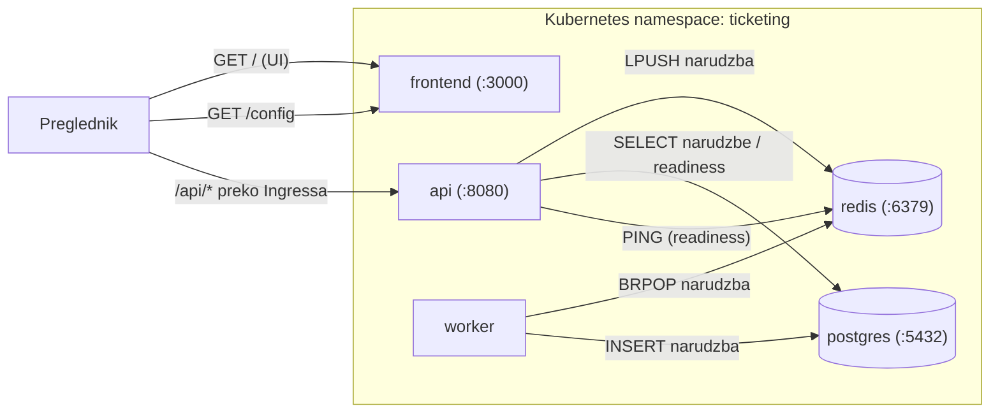

# Analiza arhitekture i dizajna

> Ovaj dokument pokriva ishod učenja **I1**: procjenu upotrebe kontejnera, odabir i uloge servisa, arhitekturu i komunikaciju među servisima, te koliko taj pristup odgovara ciljevima projekta.

---

## 1. Kontejneri ili virtualne mašine (VM)

Aplikaciju isporučujem kao **kontejnere**, a ne kao virtualne mašine. Razlika je u tome što virtualiziraju:

- **VM** virtualizira hardver. Svaki VM vrti cijeli svoj operativni sustav s vlastitom jezgrom na hipervizoru. Daje jaku izolaciju, ali je velik: zauzme više GB diska, sporo se diže i troši puno memorije.
- **Kontejner** virtualizira operativni sustav. Kontejneri dijele jezgru domaćina i odvajaju procese kroz namespace-ove i cgroupe. Slika sadrži samo aplikaciju i ono što joj treba za rad, pa su slike male (ovdje desetci MB), dignu se za manje od sekunde i puno ih stane na jedan stroj.

**Zašto kontejneri odgovaraju ovom projektu:** aplikacija ima pet malih servisa koje se često gradi i isporučuje kroz CI/CD. Kontejneri svaki servis pretvore u samostalan, ponovljiv paket koji jednako radi i na mom laptopu (kroz Compose) i na Kubernetesu. Brzo dizanje i mala potrošnja omogućuju da vrtim više replika i radim rolling update bez prekida rada, što bi s VM-om po servisu bilo sporo i skupo.

**Nedostatak kojeg sam svjestan:** kontejneri imaju slabiju izolaciju od VM-a jer dijele jezgru, pa ranjivost u jezgri ima veći domet. To ublažavam hardeningom slika (mala bazna slika, non-root korisnik, maknute capabilities, nema privilege escalationa), skeniranjem ranjivosti u CI-ju i segmentacijom mreže u klasteru. Za stvari koje traže tvrdu izolaciju među korisnicima bili bi bolji VM-ovi, ali za ovu aplikaciju s jednim vlasnikom i čestom isporukom kontejneri su pravi izbor.

---

## 2. Odabir servisa i njihove uloge

Aplikacija je podijeljena na pet servisa, svaki ima jednu jasnu zadaću:

| Servis | Uloga | Zašto je odvojen |
|--------|-------|------------------|
| **frontend** | Prikazuje web sučelje i `/config` endpoint koji pregledniku kaže gdje je API. | Samo prezentacija, može se skalirati i mijenjati neovisno o logici. |
| **api** | Stateless REST servis: izlistava evente, prima narudžbe, ima health/readiness. | Stateless obrada se lako skalira i jedini je javni ulaz za podatke. |
| **worker** | Pozadinski servis koji obrađuje narudžbe iz reda i zapisuje ih u bazu. | Odvaja sporu obradu od zahtjeva, pa API može odmah odgovoriti. |
| **postgres** | Trajna baza za obrađene narudžbe. | Podaci moraju ostati neovisno o stateless servisima. |
| **redis** | Red (queue) / cache koji nosi narudžbe od API-ja do workera. | Buffera posao i odvaja API (proizvođač) od workera (potrošač). |

**Najvažnija odluka u dizajnu** je razdvajanje **api** i **worker**. Kad dođe narudžba, API je samo provjeri i stavi u Redis red, pa odmah vrati `202 Accepted`. Pravi upis u bazu se događa kasnije, u workeru. Time API ostaje brz i kad ima puno prometa, a oba dijela se mogu skalirati zasebno (više API replika za promet, više workera za obradu).

---

## 3. Arhitektura i komunikacija među servisima

**Tok kod kupnje karte:**

1. Preglednik učita **frontend** i pozove `/config`, koji vrati gdje je API (`/api` u klasteru).
2. Preglednik pozove `GET /api/events` i prikaže evente. Ingress `/api` šalje na **api** servis.
3. Kod kupnje preglednik šalje POST na `/api/tickets/purchase`. **api** provjeri zahtjev, stavi narudžbu u Redis red (`LPUSH`) i vrati `202 Accepted` s ID-em narudžbe.
4. **worker** čeka na `BRPOP` na istom Redis redu. Uzme narudžbu i zapiše je u **postgres** sa statusom `processed`.
5. Kasniji `GET /api/tickets/orders` pročita narudžbu iz Postgresa, sad sa statusom `processed`.

**Health i ovisnosti:** `api`-jev `/readyz` radi `SELECT 1` na Postgres i `PING` na Redis, i vrati ready samo ako oba rade. Kubernetes preko te readiness probe drži api van servisa dok mu ovisnosti nisu spremne, pa kvar baze ne servira greške korisnicima.

**Mreža:** unutar klastera servisi se nalaze preko Kubernetes DNS imena (`postgres`, `redis`, `api`, `frontend`). Prema van, **Ingress** izloži jedan host (`ticketing.local`) i šalje `/` na frontend, a `/api` na api. NetworkPolicy dopušta da do Postgresa i Redisa dolaze samo api i worker.

---

## 4. Usklađenost s ciljevima projekta

Ciljevi projekta su sigurna isporuka, upravljanje slikama, orkestracija, observability i rješavanje problema. Arhitektura pokriva svaki:

- **Sigurna isporuka i upravljanje slikama:** svaki servis je hardenirana, skenirana slika (multi-stage build, mala alpine baza, non-root korisnik, maknute capabilities, maknut npm iz runtimea, zakrpani OS paketi). Slike skenira Trivy u CI-ju i objavljuju se tek nakon što prođu HIGH/CRITICAL gate, pa se postavljaju po nepromjenjivom tagu.
- **Orkestracija:** Kubernetes vrti servise preko manifesta (Deploymenti s resource requestima/limitima, više replika za stateless dio, liveness/readiness probe, Servis po komponenti, Ingress za vanjski pristup, rolling update i rollback).
- **Konfiguracija i tajne:** obična konfiguracija je u ConfigMapu, a lozinke u Secretu, predane kroz env varijable. Nema lozinki u kodu ni u slikama.
- **Najmanje privilegija i segmentacija:** vlastiti ServiceAccount s isključenim automountom tokena, minimalni Role/RoleBinding i NetworkPolicy koji dopušta samo nužan promet.
- **Observability i rješavanje problema:** health/readiness endpointi, logovi podova i `kubectl` alati čine kvarove vidljivima i popravljivima; postupci su u `docs/runbook.md`.

**Zaključak:** kontejnerizirani dizajn podijeljen na servise dobro pokriva ciljeve projekta. Odvajanje api-ja i workera preko Redis reda daje brzinu i neovisno skaliranje, a kontrole oko toga (hardening, skeniranje, RBAC, network policy, probe) čine isporuku sigurnom i operativnom. Glavni nedostatak (slabija izolacija od VM-a) svjesno je prihvaćen i ublažen, što je za ovakvu aplikaciju ispravan izbor.
