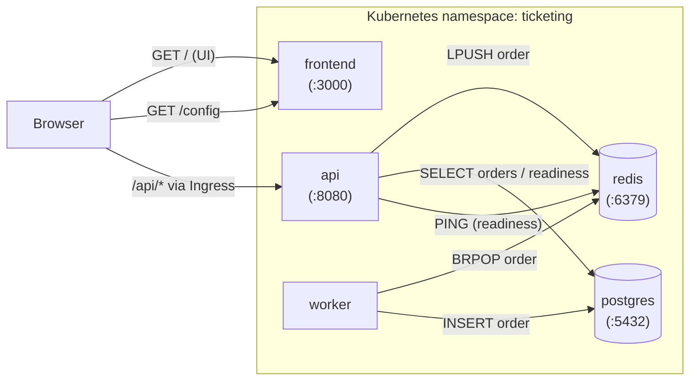

# Architecture and Design Analysis

> This document addresses learning outcome **I1**: a critical assessment of the use of
> containers, the selection and roles of the services, the inter-service architecture and
> communication, and how the chosen approach aligns with the project goals.
>
> *(Written in English; translate to Croatian if your submission requires it. Read it through
> and make sure you can explain each point in your own words — the reasoning is what is graded.)*

---

## 1. Containers vs. virtual machines

The platform is delivered as **containers** rather than virtual machines (VMs). The two approaches differ fundamentally in what they virtualise:

- A **VM** virtualises hardware. Each VM runs a full guest operating system with its own kernel on top of a hypervisor. This gives strong isolation but a large footprint — gigabytes of disk, slow (tens of seconds to minutes) boot, and significant per-instance memory overhead.
- A **container** virtualises the operating system. Containers share the host kernel and isolate processes using namespaces and cgroups. An image contains only the application and its runtime dependencies, so images are small (tens of MB here), start in well under a second, and pack densely onto a host.

**Why containers fit this project:** the application is composed of five small, independently deployable services that are built and shipped frequently through a CI/CD pipeline. Containers make each service a self-contained, reproducible artifact that runs identically on a developer laptop (via Compose) and in the Kubernetes cluster. The fast start-up and low overhead make it practical to run several replicas and to perform rolling updates with no downtime — both of which a VM-per-service model would make slow and resource-heavy.

**Trade-off acknowledged:** containers provide weaker isolation than VMs because they share the host kernel, so a kernel-level vulnerability has a wider blast radius. This project mitigates that with image hardening (minimal base, non-root user, dropped Linux capabilities, no `allowPrivilegeEscalation`), vulnerability scanning in CI, and network segmentation in the cluster. For workloads requiring hard multi-tenant isolation, VMs (or VM-isolated container runtimes) would be the better choice; for this single-tenant, frequently-deployed application, containers are the correct fit.

---

## 2. Service selection and roles

The application is decomposed into five services, each with a single clear responsibility:

| Service | Role | Why it is separate |
|---------|------|--------------------|
| **frontend** | Serves the web UI and a `/config` endpoint that tells the browser where the API is. | Pure presentation layer; can be scaled and deployed independently of business logic. |
| **api** | Stateless REST service: lists events, accepts ticket purchases, exposes health/readiness. | Stateless request handling scales horizontally and is the only public entry point for data. |
| **worker** | Background consumer that processes queued orders and writes them to the database. | Decouples slow/asynchronous processing from the request path, so the API can respond instantly. |
| **postgres** | Durable relational store for processed orders. | State must persist independently of the stateless services. |
| **redis** | Queue/cache layer carrying orders from API to worker. | Buffers work and decouples producer (api) from consumer (worker). |

**The key design decision** is splitting **api** and **worker**. When a purchase arrives, the API only needs to validate it and place it on the Redis queue, then immediately return `202 Accepted`. The actual database write happens asynchronously in the worker. This keeps the user-facing API fast and responsive even under load, and lets the two halves scale independently — more API replicas for traffic spikes, more workers for processing throughput.

---

## 3. Architecture and inter-service communication

**Request flow for a ticket purchase:**

1. The browser loads the **frontend** and calls `/config`, which returns the API base path (`/api` in the cluster).
2. The browser calls `GET /api/events` and renders the event list. Through the Ingress, the `/api` prefix is routed to the **api** service.
3. On purchase, the browser POSTs to `/api/tickets/purchase`. The **api** validates the request, pushes the order onto the Redis list with `LPUSH`, and returns `202 Accepted` with an order id.
4. The **worker** is blocked on `BRPOP` against the same Redis list. It pops the order and writes it to **postgres** with status `processed`.
5. A later `GET /api/tickets/orders` reads the persisted order back from Postgres, now showing `processed`.

**Health and dependency signalling:** the api's `/readyz` probe runs `SELECT 1` against Postgres and `PING` against Redis, returning ready only when both respond. Kubernetes uses this readiness probe to keep the api out of the Service's load-balancer rotation until its dependencies are actually available — which is exactly how a dependency outage is contained rather than serving errors to users.

**Networking:** inside the cluster, services find each other by their Kubernetes Service DNS names (`postgres`, `redis`, `api`, `frontend`). Externally, an **Ingress** exposes a single host (`ticketing.local`) and routes `/` to the frontend and `/api` to the api. NetworkPolicies restrict traffic so that only the api and worker may reach Postgres and Redis.

---

## 4. Alignment with project goals

The project goals are secure delivery, image management, orchestration, observability, and troubleshooting. The architecture supports each:

- **Secure delivery & image management:** every service is a hardened, scanned container image (multi-stage build, minimal Alpine base, non-root user, dropped capabilities, npm removed from runtime, OS packages patched). Images are scanned by Trivy in CI and only published after passing a HIGH/CRITICAL quality gate, then deployed by immutable tag.
- **Orchestration:** Kubernetes runs the services with declarative manifests — Deployments with resource requests/limits, multiple replicas for the stateless tiers, liveness/readiness probes, a Service per component, Ingress for external access, and rolling update + rollback for safe releases.
- **Configuration & secrets:** non-secret configuration is held in a ConfigMap and credentials in a Secret, injected via environment variables — no secrets are hard-coded in images or source.
- **Least privilege & segmentation:** a dedicated ServiceAccount with `automountServiceAccountToken: false`, a minimal Role/RoleBinding, and NetworkPolicies that allow only the necessary east-west traffic.
- **Observability & troubleshooting:** health/readiness endpoints, structured pod logs, and `kubectl` diagnostics make failures visible and recoverable; the procedures are captured in `docs/runbook.md`.

**Conclusion:** the containerised, service-decomposed design directly serves the DevSecOps goals of the project. The separation of concerns (especially api vs. worker via a Redis queue) provides responsiveness and independent scalability, while the surrounding controls — hardening, scanning, RBAC, network policy, probes — make the delivery both secure and operable. The main trade-off (weaker kernel-level isolation than VMs) is consciously accepted and mitigated, which is the appropriate engineering choice for this single-tenant, frequently-deployed application.
